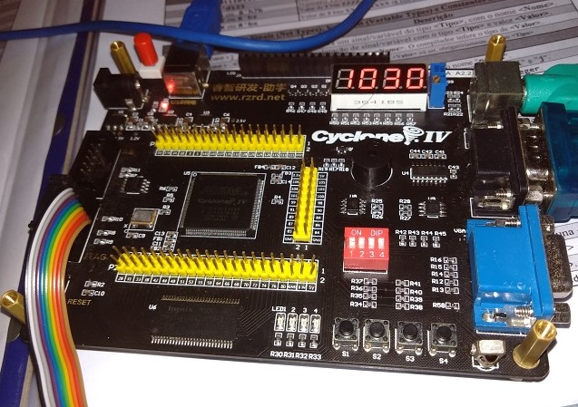

# Projeto em Verilog `Contagem_Dsp7Seg`       
 - Criado por: [Eduardo Alvim](https://github.com/dualvim)
       

## Projeto em funcionamento:     
       
        
       
        
 
         

## Código do projeto     
```verilog     
module Contagem_Dsp7Seg( input wire FPGA_CLK, output reg [7:0] SEG, output wire [3:0] DIG );
		// --> Constantees: Pulsos de clock para cada intervalo de tempo
		parameter  TICK_D0 = 18'd50000;     // Contagem de pulsos para inserir o valor no 1o digito
		parameter  TICK_D1 = 18'd100000;    // Contagem de pulsos para inserir o valor no 2o digito
		parameter  TICK_D2 = 18'd150000;    // Contagem de pulsos para inserir o valor no 3o digito
		parameter  TICK_D3 = 18'd200000;	   // Contagem de pulsos para inserir o valor no 4o digito
		parameter  TICK_1SEG = 26'd50000000; // Pulsos de clock em 1 segundo
		
		// --> Contadores de pulsos de clock:
		reg [26:0] cont1 = 4'd0;
		reg [18:0] cont2 = 4'd0;
		// --> Contador de segundos
		reg [13:0] cont_segs = 4'd0;
		// --> Valores dos digitos do display de 7 segmentos
		reg [3:0] val_d0 = 4'd0;
		reg [3:0] val_d1 = 4'd0;
		reg [3:0] val_d2 = 4'd0;
		reg [3:0] val_d3 = 4'd0;
		
		// --> Digito atual e numero a inserir no display
		reg [3:0] val = 4'd0;
		reg [3:0] dig = 4'b1110;
		// Atribuicao de 'dig' ao display de 7 segmentos 
		assign DIG = dig;
		
		// --> Bloco always executado nas bordas de subida do clock
		always @ ( posedge FPGA_CLK )
		begin
				// Incrementar os contadores 'cont1' e 'cont2'
				cont1 <= cont1 + 1;
				cont2 <= cont2 + 1;
				// Se o valor de cont2 for TICK_D0
				if( cont2 == TICK_D0 ) begin
					// Selecionar o digito 0
					dig = 4'b1110;
					// Atribuir a val o valor 'val_d0'
					val = val_d0;
				end
				// Se o valor de cont2 for 100.000
				else if( cont2 == TICK_D1 ) begin
					// Selecionar o digito 1
					dig = 4'b1101;
					// Atribuir a val o valor 'val_d1'
					val = val_d1;
				end
				// Se o valor de cont2 for TICK_D0
				else if( cont2 == TICK_D2 ) begin
					// Selecionar o digito 2
					dig = 4'b1011;
					// Atribuir a val o valor 'val_d2'
					val = val_d2;
				end
				// Se o valor de cont2 for 100.000
				else if( cont2 == TICK_D3 ) begin
					// Selecionar o digito 3
					dig = 4'b0111;
					// Atribuir a val o valor 'val_d3'
					val = val_d3;
					
					// --> Reiniciar 'cont2'
					cont2 <= 0;
				end
				// --> Se o valor de cont1 for 'TICK_1SEG' (1 segundo)
				if( cont1 == TICK_1SEG ) begin
					// --> Novo valor de 'cont_segs'
					if( cont_segs < 14'd9999 ) begin
							cont_segs <= cont_segs + 1; //Incrementar 'cont_segs'
					end
					else begin
							cont_segs <= 0;  // Reiniciar a contagem
					end
					
					// --> Calcular os valores dos 4 digitos
					val_d3 <= cont_segs / 1000;
					val_d2 <= (cont_segs % 1000) / 100;
					val_d1 <= (cont_segs % 100) / 10;
					val_d0 <= cont_segs % 10;
					
					// --> Reiniciar 'cont1'
					cont1 <= 0;
				end
		end
		
		// Bloco de codigo para escrever valor do digito atual no display
		always @ ( dig )
		begin
				case ( val )
						4'h0 : SEG = 8'b11000000;
						4'h1 : SEG = 8'b11111001;
						4'h2 : SEG = 8'b10100100; 
						4'h3 : SEG = 8'b10110000; 
						4'h4 : SEG = 8'b10011001;
						4'h5 : SEG = 8'b10010010;
						4'h6 : SEG = 8'b10000010;
						4'h7 : SEG = 8'b11111000;
						4'h8 : SEG = 8'b10000000;
						4'h9 : SEG = 8'b10010000;
						default : SEG = 8'b11111111;
				endcase
		end
endmodule
```         
        
