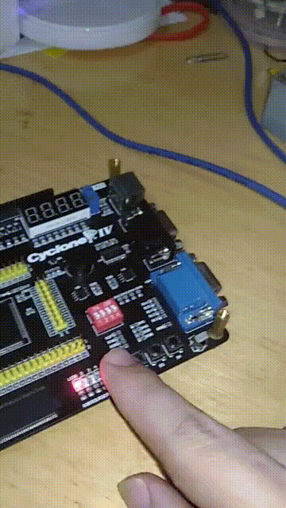

# Controle de Periféricos - Projeto 5 - `ckey_led`       
       
       

## Código do projeto     
```verilog     
module ckey_led( input wire [3:0] KEY, output wire [3:0] LED );
	assign LED = KEY;
endmodule
```         
        
