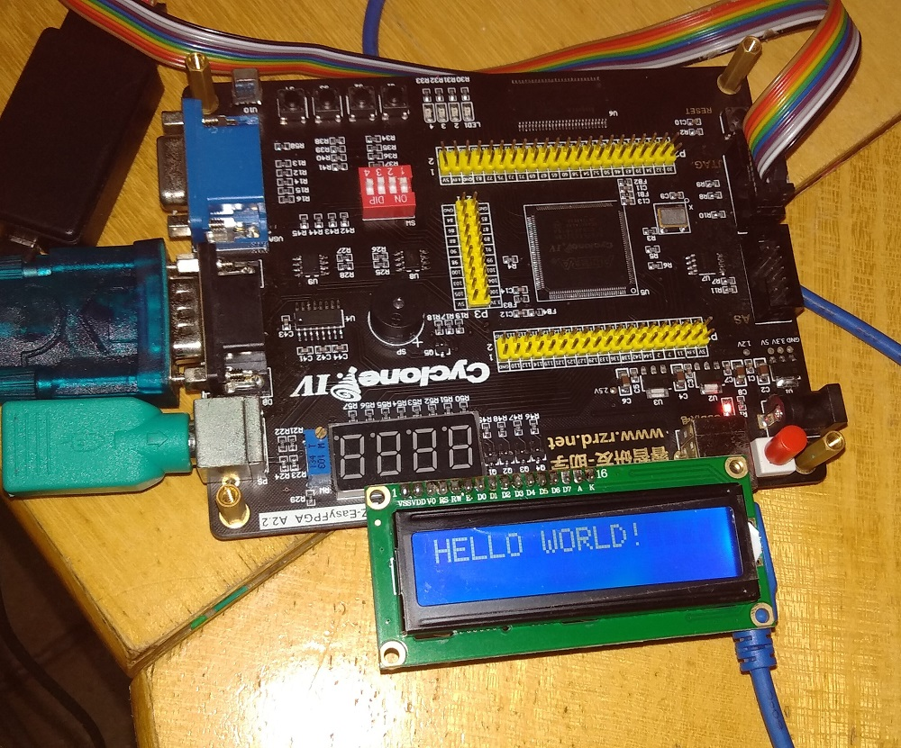

# Controle de Periféricos - Projeto 10 - Display LCD 16x2 (`lcd1602`)           
       
       

# Código do projeto (versão longa):      
```verilog
module lcd1602( input wire FPGA_CLK, output reg LCD_RS, output wire LCD_RW, output wire LCD_E, output reg [7:0] LCD_D );
		// --> Constantes
		parameter  set0=4'h0; 
		parameter  set1=4'h1; 
		parameter  set2=4'h2; 
		parameter  set3=4'h3; 
		parameter  dat0=4'h4; 
		parameter  dat1=4'h5; 
		parameter  dat2=4'h6; 
		parameter  dat3=4'h7; 
		parameter  dat4=4'h8; 
		parameter  dat5=4'h9; 
		parameter  dat6=4'hA; 
		parameter  dat7=4'hB; 
		parameter  dat8=4'hC; 
		parameter  dat9=4'hD; 
		parameter  dat10=4'hE; 
		parameter  dat11=5'h10; 
		parameter  nul=4'hF; 
		
		// Sinal referentes aos pulsos de clock
		wire clk = FPGA_CLK;
		
		// Declaracao de variaveis
		reg e, rs, clkr;
		reg [1:0] cnt; 
		reg [4:0] current, next; 
		reg [7:0] dat; 
		reg [15:0] counter; 
		
		// Bloco always executado nas bordas de subida do clock
		always @ ( posedge clk )
		begin
				// Incrementar 'counter'
				counter = counter + 1;
				
				// Se counter == 15, inverter o estado de 'clkr':
				if(counter == 16'h000f) begin
						clkr = ~clkr;
				end
		end
		
		// bloco always
		always @ ( posedge clkr )
		begin
				current = next;
				
				case(current) 
						set0:   begin  rs<=0; dat<=8'h30; next<=set1; end 
						set1:   begin  rs<=0; dat<=8'h0c; next<=set2; end 
						set2:   begin  rs<=0; dat<=8'h6; next<=set3; end 
						set3:   begin  rs<=0; dat<=8'h1; next<=dat0; end 
						dat0:   begin  rs<=1; dat<="H"; next<=dat1; end 
						dat1:   begin  rs<=1; dat<="E"; next<=dat2; end 
						dat2:   begin  rs<=1; dat<="L"; next<=dat3; end 
						dat3:   begin  rs<=1; dat<="L"; next<=dat4; end 
						dat4:   begin  rs<=1; dat<="O"; next<=dat5; end 
						dat5:   begin  rs<=1; dat<=" "; next<=dat6; end 
						dat6:   begin  rs<=1; dat<="W"; next<=dat7; end 
						dat7:   begin  rs<=1; dat<="O"; next<=dat8; end 
						dat8:   begin  rs<=1; dat<="R"; next<=dat9; end 
						dat9:   begin  rs<=1; dat<="L"; next<=dat10; end 
						dat10:   begin  rs<=1; dat<="D"; next<=dat11; end 
						dat11:   begin  rs<=1; dat<="!"; next<=nul; end
						
						nul:   
						begin 
								rs <= 0;  
								dat <= 8'h00;                   
								if( cnt!=2'h2 ) begin  
									  e <= 0;
									  next <= set0;
									  cnt <= cnt + 1;  
								end  
								
								else  begin 
									next <= nul; 
									e <= 1; 
								end    
						end 
						
						default:   next=set0;
				endcase
		end
		
		// Atribuicao de dat a LCD_D
		assign LCD_D = dat;
		
		// Atribuicao 'en' a 'LCD_E'
		assign LCD_E = clkr | e; 
		
		// Atribuicao 'LCD_RW'
		assign LCD_RW = 0; 
		
		// Atribuicao
		assign LCD_RS = rs; 
endmodule
```      
        

# Código do projeto (versão encurtada):      
```verilog
module lcd1602( input wire FPGA_CLK, output reg LCD_RS, output wire LCD_RW, output wire LCD_E, output reg [7:0] LCD_D );
		// --> Constantes
		parameter  set0 = 4'h0; 
		parameter  set1 = 4'h1; 
		parameter  set2 = 4'h2; 
		parameter  set3 = 4'h3; 
		parameter  dat0 = 4'h4; 
		parameter  dat1 = 4'h5; 
		parameter  dat2 = 4'h6; 
		parameter  dat3 = 4'h7; 
		parameter  dat4 = 4'h8; 
		parameter  dat5 = 4'h9; 
		parameter  dat6 = 4'hA; 
		parameter  dat7 = 4'hB; 
		parameter  dat8 = 4'hC; 
		parameter  dat9 = 4'hD; 
		parameter  dat10 = 4'hE; 
		parameter  dat11 = 5'h10; 
		parameter  nul = 4'hF; 
		
		// Declaracao das variaveis
		reg e, clkr;
		reg [1:0] cnt; 
		reg [4:0] current, next; 
		reg [7:0] dat; 
		reg [15:0] counter; 
		
		// Bloco always executado nas bordas de subida do clock
		always @ ( posedge FPGA_CLK )
		begin
				// Incrementar 'counter'
				counter = counter + 1;
				// Se counter == 15, inverter o estado de 'clkr':
				if(counter == 16'h000f) begin
						clkr = ~clkr;
				end
		end
		
		// bloco always executado a cada mudanca de estado em 'clkr'
		always @ ( posedge clkr )
		begin
				// Atribuir a 'current' o valor atual de 'next'
				current = next;
				// Bloco case com as acoes a depender do valor de 'current'
				case( current ) 
						set0:   begin  LCD_RS<=0; LCD_D<=8'h30; next<=set1; end 
						set1:   begin  LCD_RS<=0; LCD_D<=8'h0c; next<=set2; end 
						set2:   begin  LCD_RS<=0; LCD_D<=8'h6; next<=set3; end 
						set3:   begin  LCD_RS<=0; LCD_D<=8'h1; next<=dat0; end 
						dat0:   begin  LCD_RS<=1; LCD_D<="H"; next<=dat1; end 
						dat1:   begin  LCD_RS<=1; LCD_D<="E"; next<=dat2; end 
						dat2:   begin  LCD_RS<=1; LCD_D<="L"; next<=dat3; end 
						dat3:   begin  LCD_RS<=1; LCD_D<="L"; next<=dat4; end 
						dat4:   begin  LCD_RS<=1; LCD_D<="O"; next<=dat5; end 
						dat5:   begin  LCD_RS<=1; LCD_D<=" "; next<=dat6; end 
						dat6:   begin  LCD_RS<=1; LCD_D<="W"; next<=dat7; end 
						dat7:   begin  LCD_RS<=1; LCD_D<="O"; next<=dat8; end 
						dat8:   begin  LCD_RS<=1; LCD_D<="R"; next<=dat9; end 
						dat9:   begin  LCD_RS<=1; LCD_D<="L"; next<=dat10; end 
						dat10:   begin  LCD_RS<=1; LCD_D<="D"; next<=dat11; end 
						dat11:   begin  LCD_RS<=1; LCD_D<="!"; next<=nul; end
						// Caso 'nul'
						nul: begin 
								LCD_RS <= 0;  
								LCD_D <= 8'h00;
								//Faça isso uma vez e, em seguida, puxe o pino E do LCD
								if( cnt != 2'h2 ) begin  
									  e <= 0;
									  next <= set0;
									  cnt <= cnt + 1;  
								end  
								// Caso contrario
								else  begin 
									next <= nul; 
									e <= 1; 
								end    
						end 
						// Caso padrao
						default:   next = set0;
				endcase
		end
		
		// Atribuicao para o pino 'LCD_E'
		assign LCD_E = clkr | e; 
		
		// Atribuicao para o pino 'LCD_RW'
		assign LCD_RW = 0; 
endmodule
```     
        

