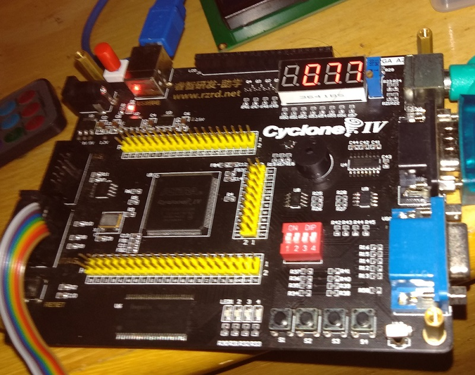

# Controle de Periféricos - Projeto 16 - Sensor de Temperatura LM75A (`LM75A`)           
       
       
    
        


# Códigos dos módulos do projeto:      
        

## Módulo `SEG_D`       
```verilog
module SEG_D( input wire clk, input wire rst_n, input [15:0] data, output reg [7:0] seg, output reg [3:0] cs);  
		// Declarar variaveis
		reg [4:0] dataout_buf;  
		reg [1:0] disp_dat;  
		reg [16:0] delay_cnt;  
		
		always@(posedge clk, negedge rst_n)  
		begin   
			if(!rst_n) begin
				delay_cnt<=16'd0;
			end
			   
			else if( delay_cnt == 16'd50000 ) begin
				delay_cnt<=16'd0;
			end
		    
			else begin
				delay_cnt <= delay_cnt + 1;
			end
		    
		end
		
		always@(posedge clk,negedge rst_n)  
		begin   
				if( !rst_n ) begin
					disp_dat <= 2'd0;
				end
            
				else if( delay_cnt == 16'd50000) begin
					disp_dat <= disp_dat + 1'b1;
				end
            
				else begin
					disp_dat <= disp_dat;
				end
		end
	
		always @ ( disp_dat )  
		begin   
			case( disp_dat )  
				2'b00: cs=4'b1110;  
				2'b01: cs=4'b1101;  
				2'b10: cs=4'b1011;  
				default cs=4'b1111;  
		  endcase   
		end
		
		always @ ( cs )
		begin
			case(cs)  
				4'b1110: dataout_buf=data[8:5];  
				4'b1101: dataout_buf=data[12:9];  
				4'b1011: dataout_buf={1'b0, data[15:13]};  
				default dataout_buf=0;  
			endcase 
		end
		
		always @ ( dataout_buf ) 
		begin
				case( dataout_buf )
						4'h0 : seg = 8'hc0; //0  
						4'h1 : seg = 8'hf9; //1  
						4'h2 : seg = 8'ha4; //2  
						4'h3 : seg = 8'hb0; //3  
						4'h4 : seg = 8'h99; //4  
						4'h5 : seg = 8'h92; //5  
						4'h6 : seg = 8'h82; //6  
						4'h7 : seg = 8'hf8; //7  
						4'h8 : seg = 8'h80; //8  
						4'h9 : seg = 8'h90; //9  
						4'ha : seg = 8'h88; //a  
						4'hb : seg = 8'h83; //b  
						4'hc : seg = 8'hc6; //c  
						4'hd : seg = 8'ha1; //d  
						4'he : seg = 8'h86; //e  
						4'hf : seg = 8'h8e; //f  
						default : seg = 8'hc0;  //0 
				endcase
		end
endmodule
```      
        

## Módulo `I2C_READ`       
```verilog
module I2C_READ( input wire clk, input wire rst_n, inout wire sda, output reg scl, output wire [15:0] data );
// Constantes globais
`define SCL_HIG (cnt == 3'd1)  
`define SCL_NEG (cnt == 3'd2)  
`define SCL_LOW (cnt == 3'd3)  
`define SCL_POS (cnt == 3'd0)

		//reg scl; // registrador de barramento SCL
		// Declaracao de variais e sinais
		reg [15:0] data_r; // Registrador de dados de temperatura
		reg sda_r; // registrador de barramento SDA
		reg sda_link; // Sinalizador de direção de dados do barramento SDA
		reg [7:0] scl_cnt; // Contador de geração de pulsos de clock SCL
		reg [2:0] cnt;     //  Usado para marcar o contador de clock SCL
		reg [25:0] timer_cnt; // Temporizador, leia os dados de temperatura a cada 2s 
		reg [3:0] data_cnt;   // Registrador de Conversão de Dados Serial para Paralelo (Data Serial to Parallel Conversion Register)
		reg [7:0] address_reg;// Registrador de endereço do dispositivo (Device Address Register) 
		reg [8:0] state; // registrador de status (status register)
		
		
		//////////////////////////////////////////////////////////////////////////////////  
		// Processo 1, 2, 3: Gerar o clock do barramento SCL
		always @ ( posedge clk or negedge rst_n )
		begin
				if( !rst_n ) begin
					scl_cnt <= 8'd0; 
				end
				
				else if( scl_cnt == 8'd199 ) begin 
					scl_cnt <= 8'd0;
				end
				
				else begin 
					scl_cnt <= scl_cnt + 1'b1;
				end
		end
		
		
		always @ ( posedge clk or negedge rst_n )
		begin 
				if( !rst_n ) begin
					cnt <= 3'd5; 
				end 
				else begin
					case( scl_cnt )
						8'd49: cnt <= 3'd1;  // Nível médio-Alto (middle high level)  
						8'd99: cnt <= 3'd2;  // Borda de descida
						8'd149:cnt <= 3'd3;  // Médio-Baixo (low middle)
						8'd199:cnt <= 3'd0;  // Borda de subida  
						default: cnt <= 3'd5;
					endcase
				end
		end
		
		always @ ( posedge clk or negedge rst_n )  
		begin  
				if( !rst_n ) begin 
					scl <= 1'b0;
				end  
					  
				else if( `SCL_POS ) begin
					scl <= 1'b1;
				end 
					  
				else if( `SCL_NEG ) begin
					scl <= 1'b0;
				end  			  
		end 

		//////////////////////////////////////////////////////////////////////////////////  
		// Processo 4: Temporizador, lendo dados de temperatura a cada 1s 
		always @ ( posedge clk or negedge rst_n )  
		begin  
        if( !rst_n ) begin
				timer_cnt <= 26'd0;
		  end  
              
        else if( timer_cnt == 26'd49999999 ) begin
		      timer_cnt <= 26'd0;
		  end  
          
        else begin
		      timer_cnt <= timer_cnt + 1'b1;
		  end
    end
	 
	 //////////////////////////////////////////////////////////////////////////////////  
	 // --> Definicao da maquina de estados
	 parameter IDLE = 9'b0_0000_0000,  
              START = 9'b0_0000_0010,  
              ADDRESS = 9'b0_0000_0100,  
              ACK1 = 9'b0_0000_1000,  
              READ1 = 9'b0_0001_0000,  
              ACK2 = 9'b0_0010_0000,  
              READ2 = 9'b0_0100_0000,  
              NACK = 9'b0_1000_0000,  
              STOP = 9'b1_0000_0000;
				  
`define DEVICE_ADDRESS 8'b1001_0001 // Endereço do dispositivo, operação de leitura
/////////////////////////////////////////////////////////////////////////////////////
		// --> Processo 5: Descrição da Máquina de Estado
		always @ ( posedge clk or negedge rst_n )
		begin
				if( !rst_n ) begin  
					data_r <= 16'd0;  
               sda_r <= 1'b1;  
               sda_link <= 1'b1;  
               state <= IDLE;  
               address_reg <= 15'd0;  
               data_cnt <= 4'd0;  
            end
				else begin
					case(state)  
						 IDLE:  
							  begin  
									sda_r   <= 1'b1;  
									sda_link <= 1'b1;  
									if(timer_cnt == 26'd49999999)  
										 state <= START;  
									else  
										 state <= IDLE;  
							  end  
						 // gerar sinal de partida
						 START:  
							  begin  
									if(`SCL_HIG)  
										 begin  
											  sda_r       <= 1'b0;  
											  sda_link    <= 1'b1;  
											  address_reg <= `DEVICE_ADDRESS;  
											  state           <= ADDRESS;  
											  data_cnt        <= 4'd0;  
										 end  
									else  
										 state <= START;  
							  end 
						 // O host endereça o dispositivo
						 ADDRESS: 
							  begin  
									if(`SCL_LOW)  
										 begin  
												// O endereçamento é concluído, o SDA muda de direção e o dispositivo está pronto para emitir um sinal de resposta
											  if(data_cnt == 4'd8) begin  
														 state   <= ACK1;  
														 data_cnt <=  4'd0;  
														 sda_r       <= 1'b1;  
														 sda_link    <= 1'b0;  
													end  
											  // Durante o endereçamento, o SDA é usado como entrada para o dispositivo
											  else begin  
													state   <= ADDRESS;  
													data_cnt <= data_cnt + 1'b1;  
													case(data_cnt)  
														4'd0: sda_r <= address_reg[7];  
														4'd0: sda_r <= address_reg[7];  
														4'd1: sda_r <= address_reg[6];  
														4'd2: sda_r <= address_reg[5];  
														4'd3: sda_r <= address_reg[4];  
														4'd4: sda_r <= address_reg[3];  
														4'd5: sda_r <= address_reg[2];  
														4'd6: sda_r <= address_reg[1];  
														4'd7: sda_r <= address_reg[0];  
														default: ;  
													endcase  
												end  
									end  
									else begin
										 state <= ADDRESS;
									end  
							  end
						 // O dispositivo emite um sinal de reconhecimento
						 ACK1:  
							  begin  
									if(!sda && (`SCL_HIG))  
										 state <= READ1;  
									else if(`SCL_NEG)  
										 state <= READ1;  
									else  
										 state <= ACK1;  
							  end
						 // Ler dados do dispositivo, byte nivel alto
						 READ1:  
							  begin
									// Os dados de bytes altos lidos são concluídos, o SDA muda de direção e o host está pronto para emitir um sinal de resposta
									if(( `SCL_LOW ) && (data_cnt == 4'd8)) begin  
											  state   <= ACK2;  
											  data_cnt <= 4'd0;  
											  sda_r       <= 1'b1;  
											  sda_link    <= 1'b1;  
									end
									// Durante a leitura de dados, o dispositivo atua como uma saída
									else if( `SCL_HIG ) begin  
											  data_cnt <= data_cnt + 1'b1;  
											  case(data_cnt)  
													4'd0: data_r[15] <= sda;  
													4'd1: data_r[14] <= sda;  
													4'd2: data_r[13] <= sda;  
													4'd3: data_r[12] <= sda;  
													4'd4: data_r[11] <= sda;  
													4'd5: data_r[10] <= sda;  
													4'd6: data_r[9]  <= sda;  
													4'd7: data_r[8]  <= sda;  
													default: ;  
											  endcase  
										 end  
									else begin
										 state <= READ1;
									end 
							  end  
						 // Sinal de resposta de saída do host
						 ACK2: 
							  begin     
									if( `SCL_LOW ) begin
										 sda_r <= 1'b0;
									end 
									else if( `SCL_NEG ) begin  
										sda_r <= 1'b1;  
										sda_link <= 1'b0;  
										state <= READ2;  
									end  
									else begin
										 state <= ACK2;
									end 
							  end  
						 // ler dados de bytes baixos (read low byte data)
						 READ2: 
							  begin  
									if( ( `SCL_LOW ) && (data_cnt == 4'd8) ) begin  
										state <= NACK;  
										data_cnt <= 4'd0;  
										sda_r <= 1'b1;  
										sda_link <= 1'b1;  
									end  
									else if( `SCL_HIG ) begin  
										data_cnt <= data_cnt + 1'b1;  
										
										case(data_cnt)  
											4'd0: data_r[7] <= sda;  
											4'd1: data_r[6] <= sda;  
											4'd2: data_r[5] <= sda;  
											4'd3: data_r[4] <= sda;  
											4'd4: data_r[3] <= sda;  
											4'd5: data_r[2] <= sda;  
											4'd6: data_r[1]  <= sda;  
											4'd7: data_r[0]  <= sda;  
											default: ;  
										endcase  
									end  
									else  
										 state <= READ2;  
							  end  
						 // Host não responde (host not answering) 
						 NACK: 
							  begin  
									if( `SCL_LOW ) begin  
											  state <= STOP;  
											  sda_r   <= 1'b0;  
									end  
									else begin
										 state <= NACK;
									end  
							  end
						 STOP:  
							  begin  
									if( `SCL_HIG ) begin  
											  state <= IDLE;  
											  sda_r <= 1'b1;  
										 end  
									else begin
										 state <= STOP;
									end 
							  end  
						 default: state <= IDLE;  
				endcase
			end
				
		end
		
		// --> Atribuicao dos sinais 'sda' e 'data'
		assign sda   = sda_link ? sda_r: 1'bz;  
		assign data  = data_r;  
endmodule
```      
        

## Módulo `LM75A` (Módulo principal)       
```verilog
module LM75A( input wire FPGA_CLK, input wire FPGA_RST, inout wire FPGA_SDA, output wire FPGA_SCL, output wire [3:0] DIG, output wire [7:0] SEG );  
		wire done;
		wire [15:0] data;
		
		// Objeto do tipo 'I2C_READ':
		I2C_READ I2C_READ( .clk(FPGA_CLK), .rst_n(FPGA_RST), .scl(FPGA_SCL), .sda(FPGA_SDA), .data(data) );
		
		// Objeto do tipo 'SEG_D'
		SEG_D  SEG_D( .clk(FPGA_CLK), .rst_n(FPGA_RST), .cs(DIG), .seg(SEG), .data(data) );
endmodule
```      
        