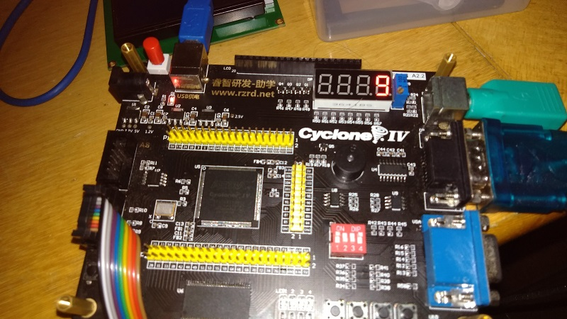

# Projeto em Verilog `switch_display`       
 - Criado por: [Diego Nagai](https://github.com/diegonagai)
       

## Projeto em funcionamento:     
       
        
 
         

## Código do projeto     
```verilog     
module switch_display ( input  wire [3:0] KEY, output wire [3:0] DIG, output [7:0] SEG);
	// Atribuicao para os digitos do display de 7 segmentos
	assign DIG = 4'b1110;
	
	// Variavel com os dados a serem inseridos no display de 7 segmentos
	reg [7:0] data_r;
	
	always @ (KEY)
	begin
		case (KEY)
			4'b1111: data_r = 8'b1100_0000; // 0
			4'b1110: data_r = 8'b1111_1001; // 1
			4'b1101: data_r = 8'b1010_0100; // 2
			4'b1100: data_r = 8'b1011_0000; // 3
			4'b1011: data_r = 8'b1001_1001; // 4
			4'b1010: data_r = 8'b1001_0010; // 5
			4'b1001: data_r = 8'b1000_0010; // 6
			4'b1000: data_r = 8'b1111_1000; // 7
			4'b0111: data_r = 8'b1000_0000; // 8
			4'b0110: data_r = 8'b1001_0000; // 9
			4'b0101: data_r = 8'b1000_1000; // A
			4'b0100: data_r = 8'b1000_0011; // b
			4'b0011: data_r = 8'b1100_0110; // C
			4'b0010: data_r = 8'b1010_0001; // d
			4'b0001: data_r = 8'b1000_0110; // E
			4'b0000: data_r = 8'b1000_1110; // F
			default: data_r = 8'b1111_1111; // OFF
		endcase
  	end
	
	// Escrever o conteudo de 'data_r' nos segmentos do display:
	assign SEG = data_r;
endmodule 
```         
        
