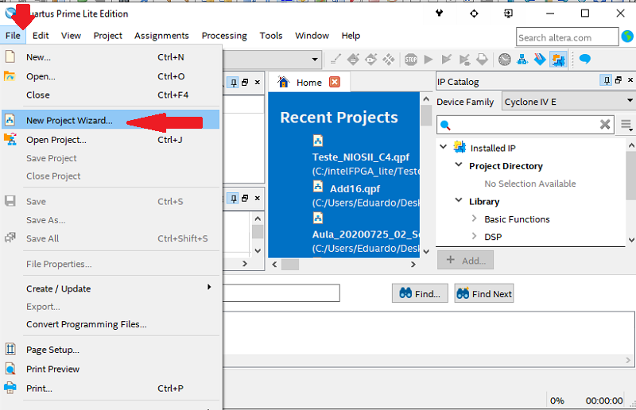

# Criar um novo projeto, para ser executado no kit EasyFPGA, no Quartus^©^ Prime Lite 20.1      
        
## 1 - Na tela inicial, ir em `File` / `New Project Wizard`     
       
       

## 2 - Na Janela que irá abrir, clicar no botão "Next >"     
       
       

## 3 - Escolher o diretório do projeto e o nome do projeto e clicar em "Next >"       
       
       

## 4 - Escolher a opção "Empty Project" e clicar em "Next >"       
       
       

## 5 - Na tela seguinte, clicar novamente em "Next >"     
       
       

## 6 - Selecionar a família "Cyclone IV" e depois o CI (_device_) EP4CE6E22C8 e, por fim, clicar no botão "Finish"          
       
       

## 7 - Na tela do projeto, criar o arquivo HDL onde será escrito o projeto      
       
       

### 7.1 - Se o projetousar a linguagem Verilog, selecionar a opção "Verilog HDL File"      
       
       

### 7.2 - Se o projetousar a linguagem VHDL, selecionar a opção "Verilog HDL File"      
       
       

### 7.3 - O Nome do novo arquivo deverá ser exatamente o mesmo do projeto.      
       
       