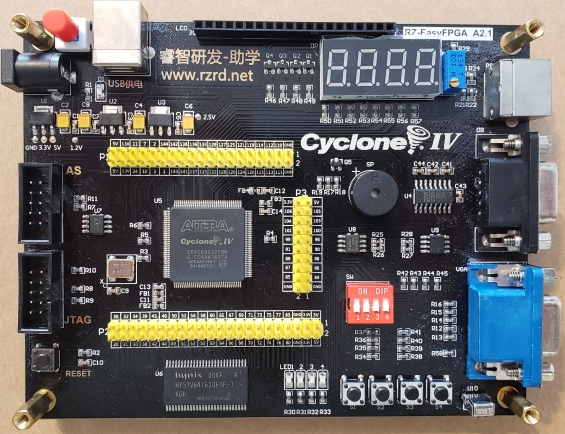
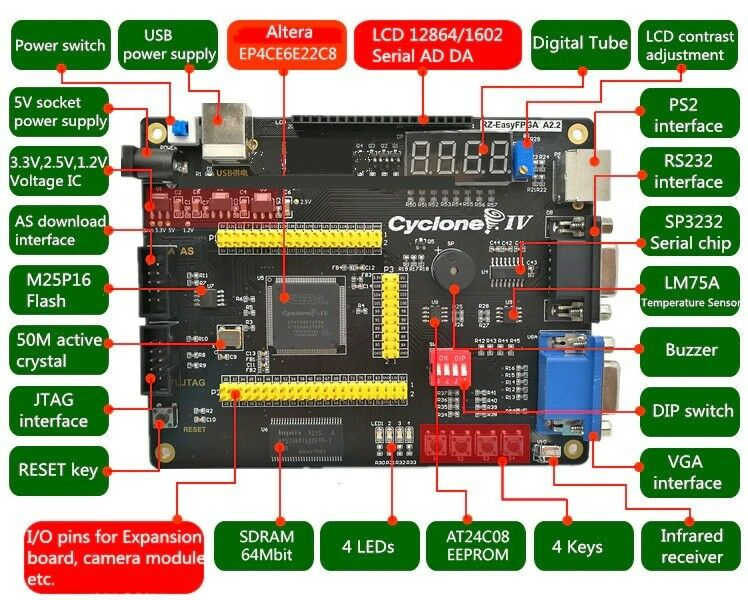

# Kit EasyFPGA A2.2 - Brasil:      
 - Esse repositório tem os seguintes **objetivos**:      
      - Compartilhar documentos e arquivos pertinentes ao **kit EasyFPGA A2.2**, em português e em inglês.     
      - **Reunir usuários brasileiros** desse kit e/ou do CI (Circuito Integrado) FPGA **EP4CE622C8**.    
      - **Compartilhar _scripts_** para FPGA escritos nas linguagems **VHDL e/ou Verilog**, destinados para serem executados no CI EP4CE6E22.   
      - **Compartilhar projetos**, criados com a ferramenta **Quartus Prime^©^** (Lite), destinados ao uso com o kit em questão.     
      - Esse repositório aceita sugestões e contribuições, bastando apenas dar um _fork_ aqui e então enviar as contribuições para as pastas adequadas nesse repo.     
      - Outro objetivo desse repositório é **ser um canal/fórum para discussões relacionadas ao kit** EasyFPGA.   
 - Todos os exemplos disponibilizados aqui foram testados no kit FPGA **EZ-EasyFPGA A2.2**, que utiliza o **CI FPGA Altera Cyclone IV EP4CE6E22C8N** e podem ser executados em outros CIs FPGA, desde que realizadas as modificações necessárias no projeto do Qartus Prime.        
 - A ideia desse repositório se baseia no repositório criado pelo professor Felippo Valiante Filho ([Repositório original](https://github.com/filippovf/KitEasyFPGA, sem atualizações recentes).
 - Sobre o **compartilhamento de conteúdo** desse _repo_:     
      - Os **mantenedores/curadores** desse _repos_ serão os autores do mesmo, os usuários **[@DiegoNagai](https://github.com/diegonagai)** e **[@DuAlvim](https://github.com/diegonagai)**.       
      - **Qualquer usuário do GitHub poderá incluir conteúdo** nesse _repo_ basta apenas dar _fork_ aqui, enviar os arquivos para a pasta adequada e e, por fim, dar um _commit_, assim que recebermos a notificação iremos atualizar.    
 - Fórum para **discussões e dúvidas**:     
      - Dúvidas e sugestões podem ser criadas no tópico **Issues** acima.      
      - Esse mesmo local também poderá ser utilizado para criar discussões sobre o conteúdo do _repo_.     
      - As dúvidas postadas aqui poderão ser respondidas tanto pelos autores, quanto por ualquer outro usuário que se sinta confortável em responder à duvida.    
       

# Sobre as pastas desse repositório:          
 - **Pasta `Docs_Kit`**: Contém arquivos referentes a documentação e _cheat sheets_ para consultas.     
      - Subpasta **`Configs_Pinos`**: _Cheat sheets_ para consultar sobre os pinos do CI FPGA EP4CE6E22C8N.  
      - Subpasta **`Datasheets`**:     
            - _Datasheet_ e _Handbook_ pertinente a linha **Cyclone^©^ IV** da Altera^©^ (arquivosd `Cyclone IV Datasheet.pdf` e `Cyclone IV Handbook.pdf`).    
            - Arquivo com informações sobre os pinos dos CIs da linha **Cyclone^©^ IV EP4CE6**.     
            - _Datasheet_ referente ao CI de memória SDRAM incluso no kit (arquivo `HY57V641620FTP.pdf`).      
      - Subpasta **_EsquemaEletrico_e_Pinagem_**:    
            - Diagrama equemático do kit, traduzido para o português (arquivo (`Diagrama_Esquematico_RZ-EasyFPGA.pdf`).   
            - Arquivo com o código a ser inserido nos arquivos `.qsf` do Quartus, para se referir aos pinos do kit (`Pinos_RZEasyFPGA.txt`).    
      - Subpasta **`Fotos`**: Pasta onde deverão ser colocadas todas as fotos usadas nas documentações desse _repo_.                
 - **Pasta `Exemplos_VHDL`**: Pasta onde deverão ser colocados projetos e códigos para o kit, escritos em VHDL.     
      - Subpasta **`Scripts_VHDL`**: Arquivos avulsos com código VHDL.       
      - As **outras subpastas** contém projetos executados no kit EasyFPGA.      
 - **Pasta `Exemplos_Verilog`**: Pasta onde deverão ser colocados projetos e códigos para o kit, escritos em VHDL.     
      - Subpasta **`Scripts_VHDL`**: Arquivos avulsos com código VHDL.       
      - As **outras subpastas** contém projetos executados no kit EasyFPGA.      
 - **Pasta `Procedimentos_Quartus`**: Exemplos mostrando como usar alguns recursos importantes do Quartus.     
      - Subpasta **`Novo_Proj_Quartus`**: Tutorial mostrando como criar um novo projeto, para ser executado no kit EasyFPGA, no Quartus^©^ Prime Lite.    
      - Subpasta **`Prog_Mem_Flash`**: Tutorial apresentando como salvar um programa na memória flash do kit FPGA.         
      - Subpasta **`Importar_Confs_Pinos`**: Como importar as configurações dos pinos usando a ferramenta _Pin Planner_ do Quartus Prime.         
	 

# Links com referências e documentos pertinentes ao kit RZ-EasyFPGA A2.2:       
       
          
 - Fabricante do kit: RZRD     
	- Site (em chinês): http://www.rzrd.net/      
	- Página do Kit (em chinês): http://www.rzrd.net/product/?79_502.html       
 - Site com **_Learning Materials_** do kit para download: http://fpga.redliquid.pl/      
 - Anúncio do site [BangGood](https://www.banggood.com/ALTERA-Cyclone-IV-EP4CE6-FPGA-Development-Board-Kit-Altera-EP4CE-NIOSII-FPGA-Board-and-USB-Downloader-Infrared-Controller-p-1622523.html?utm_source=google&utm_medium=cpc_ods&utm_content=suzy&utm_campaign=suzy-sds-7hotsale-0416&ad_id=431632765347&gclid=CjwKCAiAq8f-BRBtEiwAGr3DgeKJ2Rt23AdT5OcQP6tcpGYCOlunE4ZYTL-AukQ7KjPGcVgdonCzuRoCNY4QAvD_BwE&cur_warehouse=CN), com outros _Learning Materials_ disponíveis para download:   
	- http://myosuploads3.banggood.com/products/20200715/20200715214029manual1.rar       
	- http://myosuploads3.banggood.com/products/20200715/20200715225938manual2.rar        
	- http://myosuploads3.banggood.com/products/20200716/20200716015352manual3.rar         
	- http://myosuploads3.banggood.com/products/20200716/20200716221102manual4.rar       
	- http://myosuploads3.banggood.com/products/20200717/20200717013819manual5.rar         
	 

# Sobre o Kit FPGA  **RZ-EasyFPGA A2.2**    
       
        
 - Especificações do kit:      
      - CI FPGA: **Altera^©^ Cyclone^©^ IV EP4CE6E22C8N**.        
          - O "N" no final do código gravado no componente é apenas algo como a versão "normal" do componente.        
          - Na ferramenta Quartus Prime, selecionar o dispositivo **EP4CE6E22C8** (lá não tem o CI com final "N").    
          - Esse CI contém **6272 LEs** (_Logic Element_, elementos lógicos) e **92 GPIOs** (_General-Purpose Input/Output_).    
      - CI SDRAM: **HY57V641620F(L/S)TP-7**   
          - 64 Mbits (8MiB)    
          - 4 _memóry banks_, cada um com 16 conjuntos de 1 Mbit.     
          - Frequência do _clock_: 143 MHz.      
      

# Prós e Contras do Kit RZ-EasyFPGA A2.2
 - **PRÓS**:       
    - Ótimo custo x benefício;
    - É um CI FPGA fabricado pela Altera^©^.   
          - Empresa criadora do primeiro dispositivo de lógica reprogramável, o CI EP300.  
          - Em 2015 essa empresa foi comprada pela Intel^©^.     
    - Possui diversos periféricos interessantes integrados à placa.
    - Disponibiliza todos os pinos para conexão externa / expansão;
    - É capaz de rodar o **NIOS II^©^**, o _soft core processor_ da Altera^©^ (atualmente Intel^©^).          
- **CONTRAS**:
      - A documentação é muito ruim e o suporte do fabricante é inexistente;        
          - E quando encontra alguma documentação ou exemplos para serem executados nesse kit, geralmente está em chinês.       
	- **Os botões e as chaves (dip switch) estão ligados no mesmo pino**, não sendo possível usá-los de modo independente.   
      - Poucos botões e LEDs na placa, o gera alguns inconvenientes em testes que exigem mais botões e/ou LEDs.    
      - A quantidade de elementos lógicos disponíveis no CI EP4CE6E22C8N, 6272 LEs, é considerada uma quantidade pequena. Isso limita bastante o tamanho dos projetos que poderão ser implementados nesse kit.           
		 
